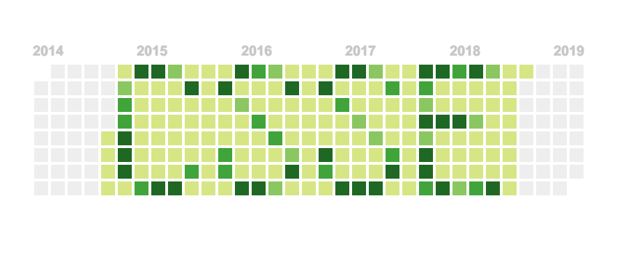

# Contribution-Graph 毕业衫创意

https://nondanee.github.io/Contribution-Graph

不多BB，你想画啥就画啥

## 说明

- 时间轴从 2013.12.30 (周一) 到 2018.12.31
- 默认浅绿色范围是在校时间 2014.9 - 2018.6
- 一小格代表一周
- 鼠标指向小格时会显示日期

(不需要这些细节的话，画布大小就没有限制了，请自由发挥)

## 功能

- 使用localStorge 恢复你上次的脑洞
- 点击格子会变颜色，循环的，点一圈可以点回来
- 左上角的空缺为reset键，左键点击清空画板，右键点击恢复到缺省

## 欧了

Host on Github Pages  
MIT License  
写得不好，欢迎PR  